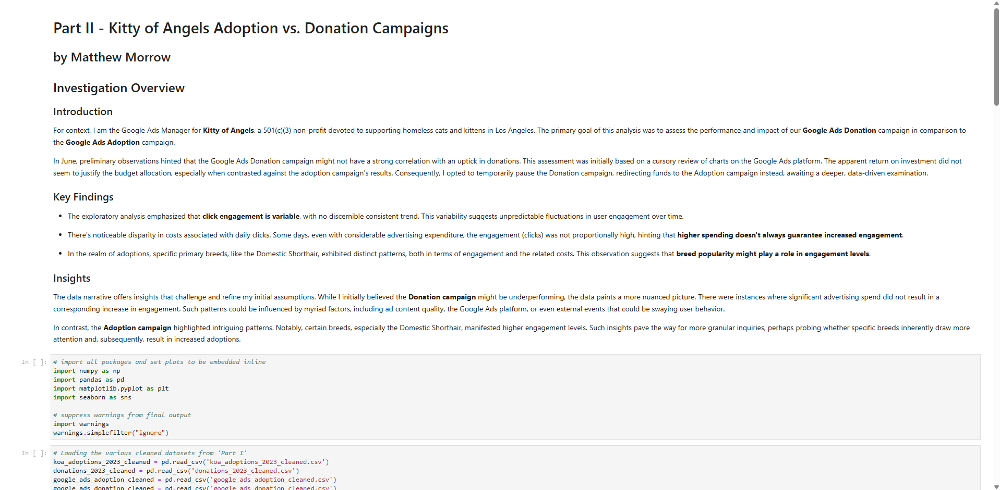

# Data-Driven Campaign Insights: Part II

**By:** Matthew Morrow

**Live Demo:** [matthewmorrow.github.io/koa-part-ii-adoption-vs-donation/](https://matthewmorrow.github.io/koa-part-ii-adoption-vs-donation/)

**Project Context:**  Continuing as Google Ads specialist for Kitty of Angels, Part II deepens the data analysis from Part I to refine campaign strategies for adoptions and donations.

**Goal:**  Build upon Part I's exploratory analysis. Use combined datasets and more advanced visualizations to gain deeper insights into campaign performance, cost-effectiveness, and breed-specific trends.

**Key Skills Showcased (Building on Part I):**

*   Advanced Data Visualization:  Creation of combined histograms, box plots with overlays, and facet plots to compare campaign types and breed performance.
*   Comparative Analysis:  Directly compare and contrast adoption vs. donation campaign metrics using visualizations.
*   Insight-Driven Recommendations:  Formulate strategic considerations and potential optimizations based on data-driven observations.
*   Python Libraries (Pandas, Seaborn, Matplotlib): Continued demonstration of proficiency in Python data analysis tools.

**Analysis Highlights:**

*   Clicks Distribution: Combined histogram reveals broader click distribution for Adoption campaigns vs. Donation campaigns.
*   Advertising Spend: Box plots compare the distribution of advertising costs between campaign types.
*   Breed-Specific Trends: Facet plots explore the relationship between ad cost and clicks, segmented by animal breed, uncovering breed-specific engagement patterns.

**Project Files:** `Part_II_Adoption_vs_Donation.ipynb` (Jupyter Notebook), data CSVs, `README.md`.
